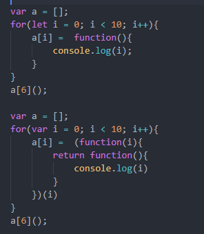

# 一、简答题
## 1、
执行结果：10  
因为按js代码的执行顺序，for循环会优先执行完，这时变量 i 已经是10了，然后无论执行数组中保存的哪个事件输出都会是10.  
如果想执行第几个就输出几，如下图所示，可以使用闭包把i保存到内存中或者使用es6的let来定义i  
    

## 2、
会报错  
因为 let 是块级作用域，且必须先定义，后使用，console.log放在了与let同一块级作用域下，且放到了let之前，所以会报错。  

## 3、
可以使用扩展运算符...
```
Math.min(...arr)
```

## 4、
var 存在变量提升，可以先使用，后定义，且可重复定义，后面的会覆盖前面的  
let与const 是块级作用域，都必须先定义，后使用，否则会抛出错误,不同块级作用域下互不影响  
let 不能重复定义  
const 只能用来定义常量，定义后不能改变，但定义对象或者数组时，可以改变里面的值，内存地址不发生改变即可

## 5、
